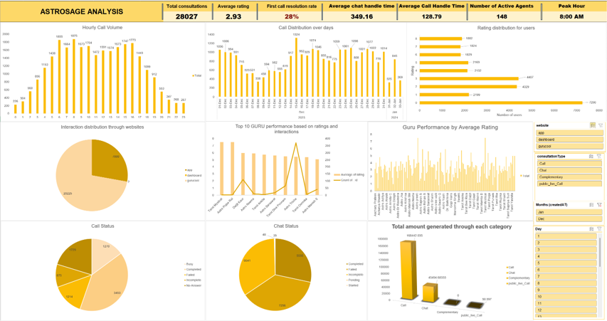

# Astrosage_Analysis

# 📊 AstroSage Call Center Analysis

## 📌 Project Overview

This project analyzes AstroSage call center data to understand customer demand, agent performance, revenue patterns, and operational efficiency.

The objective was to transform raw call center data into meaningful business insights that can help improve workforce planning, customer satisfaction, and agent performance.

The analysis was performed using **Microsoft Excel**, including data cleaning, Pivot Tables, data analysis, and dashboard creation.

---

## 🛠️ Tools & Skills

- Microsoft Excel
- Data Cleaning
- Pivot Tables
- Power Query
- Data Analysis
- Dashboard Creation
- KPI Analysis
- Business Insights

---

## 🎯 Business Objectives

The analysis focuses on answering key business questions:

- Which app/category receives the highest number of calls?
- What are the peak hours for customer demand?
- Which agents perform better based on customer ratings?
- Does agent experience influence customer satisfaction?
- Which areas contribute significantly to revenue?
- Where are the major workload bottlenecks?
- How can agent performance and workforce allocation be improved?

---

## 📊 Dashboard

An interactive Excel dashboard was created to monitor key performance indicators and identify trends across the call center.

### Key Metrics & Analysis

- Total Calls
- Total Revenue
- Average Customer Rating
- App/Category-wise Call Volume
- Agent Performance
- Peak Call Hours
- Revenue Analysis
- Customer Rating Analysis

### Dashboard Preview

---

## 🔍 Key Insights

### 1. High Customer Demand

The **AstroSage app/category receives the highest number of calls**, indicating strong customer demand and engagement.

### 2. Agent Experience & Customer Feedback

Experienced agents generally receive **better customer ratings**, indicating that experience may contribute to improved consultation quality and customer satisfaction.

### 3. Peak-Hour Workload

Call volumes are concentrated during specific hours, creating periods of higher workload for agents and potential operational bottlenecks.

### 4. Agent Performance

There is a noticeable difference in performance across agents, highlighting opportunities for targeted training and performance improvement.

### 5. Revenue Concentration

Revenue analysis helps identify the segments contributing significantly to overall consultation revenue, allowing the business to focus resources on high-value areas.

---

## 💡 Business Recommendations

Based on the analysis:

- **Optimize workforce allocation** during peak call hours to reduce workload bottlenecks.
- Introduce **performance-based incentives** for consistently high-performing agents.
- Use experienced agents to **mentor and train newer agents**.
- Monitor customer ratings regularly to identify changes in service quality.
- Use historical call patterns for **data-driven workforce planning**.

---

## 📁 Project Files

| File | Description |
|---|---|
| `ASTROSAGE_PROJECT.xlsx` | Excel analysis and dashboard |
| `ASTROSAGE_ANALYSIS.pptx` | Project presentation |
| `ASTROSAGE_DOCUMENTATION.docx` | Detailed project documentation |

---

## 📈 Skills Demonstrated

This project demonstrates practical experience in:

**Excel | Data Cleaning | Data Analysis | Pivot Tables | Dashboard Development | KPI Analysis | Business Problem Solving**

---

## 👨‍💻 Author

**Sathya**

Aspiring Data Analyst

**Skills:**  Excel | SQL | PowerBI
